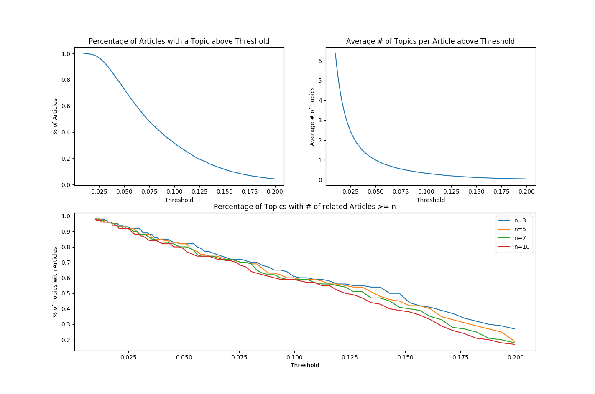
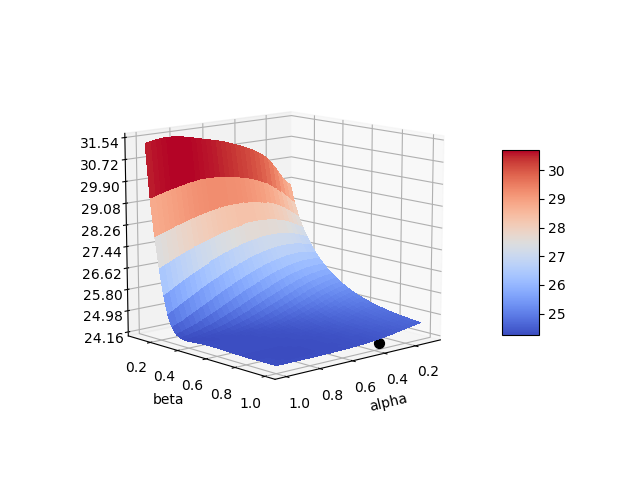

# working_title
dsi project markdown. [Witty pun here]

<!-- TODO: link to relevant scripts for their respective sections here -->
<!-- Requires final model to be done and scripts to be reorganized into logical structure -->

## Table Of Contents

* [Concept](#concept)
* [Process](#process)
* [Data](#data)
  * [Data Storage](#data-storage)
  * [Data Manipulation](#data-manipulation)
* [Modeling](#modeling)
  * [Hyper-Parameter Selection](#hyper-parameter-selection)
  * [Predictive Algorithms](#numerical-predictive-acceleration-algorithms)
* [Web App](#web-app)
  * [Visualization](#visualization)
  * [AWS EC2 Instance](#aws-ec2-instance)
* [Future Goals](#future-goals)
  * [Live Data](#live-data)
* [Acknowledgments](#acknowledgments)

## Concept

Predictive capability to grab future trends based on time series analysis of topics. Using natural language processing to pull out key/topic words from a news article, this app(?) will look to predict rising trends that have not reached the top of the pages in popularity. These predicted values will be determined by first and second order rates of growth in topics.

## Process

### Workflow Visualization <Block Diagram>

  Data Collection (Web Scrapping) -> Data Storage (S3) -> Token/Lemmy(Spacy) -> Vectorizing/Topic Generating (sklearn) -> Time Series Analysis (Still comparing) -> Web App (Flask)

  <!-- 

    -->

## Data

News Articles from all topics/sections over a period of at the time previous 5 months (7/1/2017 - 11/15/2017) [End date will change]

### Detail sources, what news sources needed what, show how to reproduce data collection
* How I got keys, from whom (NYT API website, NEWS API website)
* Requests library along with BeautifulSoup for web scraping

### Data Storage

* Collective data is stored on S3 in following fashion:

| # | _id                  | headline              | pub_date   | section_name | web_url | word_count | content     | news_source |
| - | -------------------- | --------------------- | :--------: | ------------ |:-------:| :--------: | ----------- | ----------- |
| 0 | 09ig34w09ibs90iw34sb | Top 10 Reasons To...  | 0000-00-00 | NA           | https:  | 512        | This is a   | NYT         |
| 1 | tu8936nmvb09u8mtv4mu | Newsy News News...    | 0000-00-00 | Popular      | hhtps:  | 256        | story about | Wash Post   |
| 2 | tvs3um89psv48um9pet3 | Breaking News Here... | 0000-00-00 | Sports       | https:  | 123        | how my life | ESPN        |

* id : unique identifier provided by source if one exists

<include remainder of column descriptions here>

### Data Manipulation

First goal is top convert article text into a list of words (tokenizing) and group similar words, especially synonyms, into a singular root word (lemmatizing). I utilized Spacy <url link> to accomplish this task. Additionally, generic article content were added to the list of stop words to exclude them from final list of words. This includes things like author bylines, contact us lines, and publication time stamps that don't add any substance to the content of an article. Lastly, tokens containing only punctuation or numbers were removed from the list for the similar reason.

<Show examples of this process, text to tokens>

## Modeling

### Hyper-parameter Selection

Topic selection is significant to the outcome of the predictive modeling. Varying from a small selection of topics at 10, to a comprehensive selection at 1000 topics, a final topic size of [] was selected.

<Show figure of Reconstruction error and similarities here>

Threshold selection of minimum similarity between article and content determines how many articles fall within each topic. Comparing the article selections provided by ranging threshold shows an optimal threshold of ~0.05. Optimal was specified by being small enough to have the greatest percentage of articles in related to a  topic while not too small and having articles related to multiple topics.

 

### Numerical Predictive Acceleration Algorithms <Rename>

Currently comparing three(ish) time series predictive techniques
(Add descriptions of each in their sections)

1) Autoregressive–moving-average model

2) Holt-Winter Model (seasonality) exponentially weighted average
  * Double vs Triple exponential

 

 

3) pyflux.models
  * ARIMAX
  * beta-t-EGARCH
  * GAS

<Plot of differences in errors here>

## Web App
Ran from AWS utilizing flask through python.
URL found here (when up and running)

<Image of index page here>

### Visualization
Given model, show probability of new trending topics
* Plots across time

<Images Here>

* Word Clouds of the top [n] words per topic.

<Images Here>

### AWS EC2 Instance
* Throw specs of final utilized instance to run web app
* General instructions to setup instance (depends on how user wants to provide data):
        AWS setup -> IAM role to get data from S3 bucket
        EC2 Instance -> install boto3: pip install boto3
                      b3c = boto3.resource('s3')
                      bucket = b3c.Bucket('peterrussodsiproj')
                      <In repo root directory>
                      bucket.download_file('temp_data1.csv','temp_data1.csv')
                      install spacy: conda install -c conda-forge spacy
                                 python -m spacy download en
                      install pyflux: pip install pyflux

## Future Goals

### Live Data
Streaming data from news sources (decide upon update interval daily/weekly, create script to do that)
May refit on old predicted data, and predict on new data
Using time series analysis to pull rising trends
Currently thinking dashboard ran through flask unless I find a better alternative

## Acknowledgments
Again grab url's for this section
* spacy
* pyflux
* jQCloud
* News Sources I utilized for making their articles available
* And from viewers like you

<!-- AWS setup -> IAM role to get data from S3 bucket
EC2 Instance -> install boto3: pip install boto3
                    b3c = boto3.resource('s3')
                    bucket = b3c.Bucket('peterrussodsiproj')
                    <In repo root directory>
                    bucket.download_file('temp_data1.csv','temp_data1.csv')
                install spacy: conda install -c conda-forge spacy
                               python -m spacy download en
                install pyflux: pip install pyflux

ctrl+b release then d

## Schedy (for me)

11/14-11/17
* convert from json dump into an organized fashion containing only important features
* create a pipeline for natural language processing where I can test various methods
* create a pipeline for time series analysis where "                  "

11/18-11/19
* Get an MVP model ready to go
* Test various methodologies and rate their general performance

11/20-11/24
* Make final selection on model and look to optimize parameters
* Quantify time series analysis (what growth rates are we looking for?)
* Setup MVP Web App that just gets it done
* Look into public/private access rights on AWS EC2 and S3 to makes sure another can use it (but wait till ready)

11/25-end
* Make web app user friendly and easy on the eyes
* Let it run for test periods of times by itself (I'm not logged in)
* Open to public access (maybe?)
* Finish this markdown and make it look good

Thursday Presentations 4 minutes
Monday dress rehersal

*** END  *** -->
