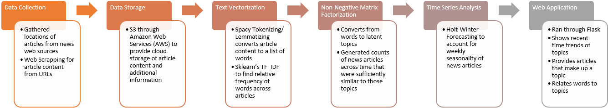

# Time Series Trending of News Articles Organized through Latent Topics
Galvanize DSI Capstone
<!-- TODO: link to relevant scripts for their respective sections here -->
<!-- Requires final model to be done and scripts to be reorganized into logical structure -->

## Table Of Contents

* [Concept](#concept)
* [Process](#process)
* [Data](#data)
  * [Data Storage](#data-storage)
  * [Data Manipulation](#data-manipulation)
* [Modeling](#modeling)
  * [Hyper-Parameter Selection](#hyper-parameter-selection)
  * [Predictive Algorithms](#numerical-predictive-acceleration-algorithms)
* [Web App](#web-app)
  * [Visualization](#visualization)
  * [AWS EC2 Instance](#aws-ec2-instance)
* [Future Goals](#future-goals)
  * [Live Data](#live-data)
  * [News Source Analysis](#news-source-analysis)
* [Acknowledgments](#acknowledgments)

## Concept

Predictive capability to grab future trends based on time series analysis of topics. Using natural language processing and Non-negative Matrix Factorization (NMF) to pull out key/topic words from news articles, this model looks to see latent topics that have rising rates of publication. These predicted values will be determined by first and second order rates of growth in topics.

## Process

### Workflow Visualization <Block Diagram>

  

## Data

News Articles from all topics/sections over a period of at the time previous 5 months (7/1/2017 - 11/28/2017)

### Detail sources, what news sources needed what, show how to reproduce data collection
* Listing of articles were either provided through an API interface (NYT API website, NEWS API website), or through web scraping news sources' article archive search
* Requests library along with BeautifulSoup for web scraping and extracting the important elements of the articles as given below

### Data Storage

* Collective data is stored on S3 in following fashion:

| # | _id                  | headline              | pub_date   | section_name | web_url | word_count | content     | news_source |
| - | -------------------- | --------------------- | :--------: | ------------ |:-------:| :--------: | ----------- | ----------- |
| 0 | 09ig34w09ibs90iw34sb | Top 10 Reasons To...  | 0000-00-00 | NA           | https:  | 512        | This is a   | NYT         |
| 1 | tu8936nmvb09u8mtv4mu | Newsy News News...    | 0000-00-00 | Popular      | hhtps:  | 256        | story about | Wash Post   |
| 2 | tvs3um89psv48um9pet3 | Breaking News Here... | 0000-00-00 | Sports       | https:  | 123        | how my life | ESPN        |

* id : unique identifier provided by source if one exists
* headline: provided article headline
* pub_date: publication date
* section_name: news section of article if provided/relevant to news sources
* web_url: url of news article
* word_count: count of words in article (used to eliminate extremely short articles)
* news_source: source of news article

### Data Manipulation

First goal is to convert article text into a list of words (tokenizing) and group similar words, especially synonyms, into a singular root word (lemmatizing). I utilized spaCy to accomplish this task. Additionally, generic article content were added to the list of stop words to exclude them from final list of words. This includes things like author bylines, contact us lines, and numbered things like publication time stamps that don't add any substance to the content of an article. Lastly, tokens containing only punctuation or numbers were removed from the list for the similar reason.

  

## Modeling

### Hyper-parameter Selection

Topic selection is significant to the outcome of the predictive modeling. Varying from a small selection of topics at 10, to a comprehensive selection at 1000 topics, a final topic size of 500 was selected. This was decided upon comparing the similarity between topics, similarity between articles in a topic, and the reconstruction error for the Non-Negative Matrix Factorization.

Threshold selection of minimum similarity between article and content determines how many articles fall within each topic. Comparing the article selections provided by ranging threshold shows an optimal threshold of ~0.05. Optimal was specified by being small enough to have the greatest percentage of articles in related to a  topic while not too small and having articles related to multiple topics.

 

### Numerical Predictive Acceleration Algorithms <Rename>

#### Holt-Winter Model (seasonality) exponentially weighted average
  * Triple exponential forecasting to predict future trends
  * Seasonality is noticed for topics on a weekly (7-day) cycle
  * Incorporates three Hyper-parameters:
    * Alpha - the importance of the prior values
    * Beta - the importance of the trending behavior (rate of change)
    * Gamma - the relative importance of seasonality

 

Sum of Squared Errors across a subset of the article corpus to show ranges of errors across ranging Hyper-Parameters (Black point indicates location of minimum error)
 

## Web App
Ran from AWS utilizing flask through python.

### Visualization

#### Word Clouds of the top words per topic.
Given a provided topic, presents the words that make up that topic sized by the relative importance of word in that topic.
<!--  -->

#### Plots across time
Shows a recent time trend of article counts from a provided topic, including a prediction on future behavior.
<!--  -->

#### Articles from Specific Topic
Given a provided topic, lists the articles that constitute that topic.
<!--  -->

#### Topics from Specific Word
Given a provided token (word), lists the topics that contain the token.
<!--  -->

### AWS EC2 Instance
* Allows flask web application to be continuously ran and accessed from any location
* General instructions to setup instance (depends on how user wants to provide data):
  * AWS setup -> IAM role to get data from S3 bucket if that is source of articles
  * EC2 Instance requires standard python/anaconda suite of libraries, but additionally needs boto3 if S3 utilized, spaCy for natural language processing, and flask to run web application

## Future Goals

### Live Data
* Automated streaming data from news sources (decided upon update interval daily/weekly)
* Automated retraining of model and topic generation

### News Source Analysis
* Provided a greater and more comprehensive corpus of news articles, train independently on news source to see differences amongst news sources
* Similarity, train independently on provided news section (Sports, Arts, World) to see impact on time series analysis

## Acknowledgments
* spaCy - https://spaCy.io/
* jQCloud - http://mistic100.github.io/jQCloud/index.html
* Special thanks to NYT and NEWS API for providing easy access to article collections
* Grisha Trubetskoy's Holt-Winter Blog for resource on implementation of said model - https://grisha.org/blog/2016/01/29/triple-exponential-smoothing-forecasting/

<!-- AWS setup -> IAM role to get data from S3 bucket
EC2 Instance -> install boto3: pip install boto3
                    b3c = boto3.resource('s3')
                    bucket = b3c.Bucket('peterrussodsiproj')
                    <In repo root directory>
                    bucket.download_file('temp_data1.csv','temp_data1.csv')
                install spaCy: conda install -c conda-forge spaCy
                               python -m spaCy download en
                install pyflux: pip install pyflux

ctrl+b release then d

## Schedy (for me)

11/14-11/17
* convert from json dump into an organized fashion containing only important features
* create a pipeline for natural language processing where I can test various methods
* create a pipeline for time series analysis where "                  "

11/18-11/19
* Get an MVP model ready to go
* Test various methodologies and rate their general performance

11/20-11/24
* Make final selection on model and look to optimize parameters
* Quantify time series analysis (what growth rates are we looking for?)
* Setup MVP Web App that just gets it done
* Look into public/private access rights on AWS EC2 and S3 to makes sure another can use it (but wait till ready)

11/25-end
* Make web app user friendly and easy on the eyes
* Let it run for test periods of times by itself (I'm not logged in)
* Open to public access (maybe?)
* Finish this markdown and make it look good

train on topics with over a threshold of counts

Thursday Presentations 4 minutes
Monday dress rehersal

*** END  *** -->
